# Deploying your Open edX on Azure
This repo contains guides and tools designed to help you deploy and manage a highly available and scalable Open edX on Azure.
If you have Azure account you can deploy Open edX via the Azure portal using the guidelines below. Please note that while you can use an Azure free account to get started depending on which configuration you choose you will likely be required to upgrade to a paid account.


## Fully configurable deployment
The number of configuration options might be overwhelming, so some pre-defined/restricted deployment options for typical Open edX scenarios follow this.

## Predefined deployment options
Below are a list of pre-defined/restricted deployment options based on typical deployment scenarios (i.e. dev/test, production etc.)

| Deployment Type            | Description                                                                                                    | Environment Preferred |
|----------------------------|----------------------------------------------------------------------------------------------------------------|-----------------------|
| Minimal                    | Single machine instance                                                                                        | Development and Test  |
| High availability instance | A production stack comprising of various Azure components as mentioned in LaaS Architecture | Production            |

## Deploying single machine instance (for development and test)

### Server Requirements 
The following server requirements will be fine for supporting hundreds of registered students on a single server.

Note: This will run MySQL, Memcache, Mongo, Nginx, and all of the Open edX services (LMS, Studio, Forums, ORA, etc) on a single server. In production configurations we recommend that these services run on different servers and that a load balancer be used for redundancy. Setting up production configurations is beyond the scope of this README.

* Ubuntu 16.04 amd64 (oraclejdk required). It may seem like other versions of Ubuntu will be fine, but they are not.  Only 16.04 is known to work.
* Minimum 8GB of memory
* At least one 2.00GHz CPU
* Minimum 25GB of free disk, 50GB recommended for production level use

### Installation Instructions

Execute `onebox.sh` on any Ubuntu 16 machine.

Common parameter argument options: pick a cell from each column. The first row is what happens when no additional parameter arguments are provided.

`--role` or `-r` or <br/> `--stack` or `-s` | `--branches` or `-b` | credential parameter arguments | `--msft-oauth`
--- | --- | --- | ---
`fullstack` (default) | `edge` (default) <br/> (oxa/dev.fic branches) | randomly generated (default) | off (default)
`devstack` | `ginkgo` <br/> (edx repositories and <br/> open-release/ginkgo.1 tag) | `--default-password` or `-d` <br/> `anyString` <br/> (set all passwords to anyString) | `prod` <br/> (uses login.live)
 &nbsp; | `release` <br/> (oxa/release.fic branches)  | &nbsp; | &nbsp; 
 &nbsp; | `stable` <br/> (oxa/master.fic branches) | &nbsp; | &nbsp; 
 &nbsp; | `ficus` <br/> (edx repositories and <br/> open-release/ficus.1 tag) | &nbsp; | &nbsp; 
 &nbsp; | edit onebox.sh to specify custom <br/> remote urls and branches directly | edit onebox.sh to specify custom <br/> usernames and passwords directly | &nbsp; 

For example:
`sudo onebox.sh` OR
`sudo bash onebox.sh -r devstack -b stable -d hokiePokiePass11 --msft-oauth prod`

What's been tested: server edition on azure, desktop edition in virtualbox VM, docker containers with systemd. Please open an "issue" in Github if you encounter any problems.

## Deploying high availability instance (for production-like environments)

When you complete the step in this guide, your Content Management System (CMS, also called Studio)
and your Learning Management System (LMS) will be operational.
The deployment covered in this guide has the architecture shown below. This architecture is designed
to be a scalable and highly available Open edX solution.

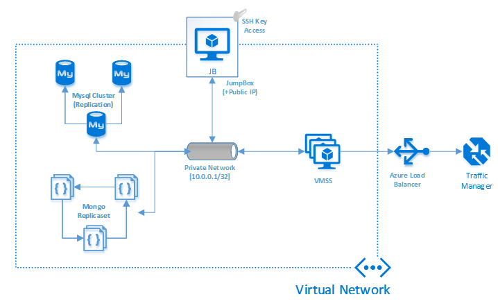

*Figure 2: LaaS Architecture*

To do the Open edX Deployment, you’ll create and then run a PowerShell script. The script will
provision the required Azure Virtual Machines and setup the right configurations and deploy them on Azure. 
The whole process can take several hours. The format of the PowerShell script is shown below.
This guide covers how to gather the various parameters used in the script.

Note: After retrieving the parameters and creating your deployment script, you will run the PowerShell
script in Administrator mode.

~~~~
[Enlistment Root]\oxa-tools\scripts\Deploy-OxaStamp.ps1 -ResourceGroupName [Cluster
Name] -Location "[Location]" -TargetPath "[Enlistment Root]\oxatools\config\stamp\default" -AadWebClientId 
“<AADWebClientId>” -AadWebClientAppKey “<AADWebClientAppKey>” -AadTenantId “<AADTenantId>” -AzureSubscriptionName
“[Subscription Name]” -KeyVaultDeploymentArmTemplateFile "[Enlistment Root]\oxatools\templates\stamp\stamp-keyvault.json" 
-FullDeploymentParametersFile "[Enlistment Root]\oxa-tools\config\stamp\default\parameters.json" -FullDeploymentArmTemplateFile
"[Enlistment Root]\oxa-tools\templates\stamp\stamp-v2.json" -
ClusterAdministratorEmailAddress [ClusterAdministratorEmailAddress] -SmtpServer “<SMTP
Server Name>” -SmtpServerPort <SMTP Server Port> -SmtpAuthenticationUser “<SMTP Auth
User>” -SmtpAuthenticationUserPassword “<SMTP Auth User password>” -
ServiceAccountPassword “<Service Account Password>” -EnableMobileRestApi -
AzureCliVersion 2 -PlatformName “<Name of the Open edX Site>” -PlatformEmailAddress
“<PlatformEmailAddress>”
~~~~

 ### 1. Prepare for Collecting Parameters
 You will do several steps to get tools, commandlets, and settings to collect your parameters.
 #### 1.1. Azure Subscription
 You need an Azure subscription for this installation. To install Open edX on Azure for LaaS, you will need
a minimum of 16-cores. Make sure that your subscription is equipped to provision 16 or more cores
before you start the deployment.
 #### 1.2. Install Azure Command Line Interface
 Download and install Azure CLI from https://aka.ms/InstallAzureCliWindows. Confirm you have Azure
CLI version 2.0 or greater by opening the Windows command prompt and enter
~~~~
az --version 
~~~~
You will see azure-cli (2.x.xx) in the response. 
 #### 1.3. Install Azure PowerShell Cmdlets
 Go to https://docs.microsoft.com/en-us/powershell/azure/install-azurerm-ps?view=azurermps-4.4.1
You need to open Windows PowerShell in administrator (elevated) mode first
You may need to change the default execution policy on your machine to install AzureRM module using
the following command.
~~~~
Set-ExecutionPolicy Bypass
~~~~
This installation may take 10 minutes. 

 #### 1.4. Install Bash
 Download and Install Git Bash for Windows here: https://git-scm.com/download/win. Select default
options when prompted.
 #### 1.5. Sync Configuration Files 
 From your Bash console (Launch Git Bash by typing Git Bash from Windows start menu), run the
following command to clone the source to your local folder. In this example, the clone is downloaded to
the c:/laas/oxa-tools folder.
````git clone -b oxa/master.fic https://github.com/Microsoft/oxa-tools.git c:/laas/oxa-tools````
In this example your [Enlistment Root] folder is “c:/laas”. 
 #### 1.6. Get SSL Certificate and prepare for use in deployment
 In this step, you’ll create SSL certificate and key files so that you can use customized URLs for your
production LMS and CMS. For example, if your URLs are going to be https://www.contosoacademy.com
(LMS) and http://www.studio.contosoacademy.com (CMS) you need to get the base URL SSL for
contosoacademy.com and the subject alternate name from certification authority for
*.contosoacademy.com.
Note: There is a sample SSL certificate in the default configuration folder
[Enlistment Root]/oxa-tools/config/stamp/default
The sample is a self-signed certificate and will give an SSL warning in the browser if used. 
 ##### 1.6.1. Convert SSL Certificate to obtain public and private keys
 ~~~~
    1. Export the private key:
    openssl pkcs12 -in [ PATH-TO-PFX ] -nocerts -out ~/key.pem -nodes
    2. Export the certificate:
    openssl pkcs12 -in [ PATH-TO-PFX ] -nokeys -out ~cert.crt
    3. Remove the passphrase from the private key:
    openssl rsa -in ~/key.pem -out ~/cert.key
    4. Copy the cert.crt and cert.key to the folder:
    [Enlistment Root]/oxa-tools/config/stamp/default
 ~~~~
 ### 2. Modifying Deployment Scripts
 To prepare your cluster configuration, familiarize yourself with the LaaS architecture.
In this step, you’ll be modifying files that you downloaded from GitHub (example: c:/laas/oxatools/config/stamp/default).
#### 2.1. Determine deployment environment
You may choose to have multiple instances running, one for Production, another for Testing, and
another for Build-Verify-Test (bvt). For this documentation, the examples reference a bvt environment.
 #### 2.2. Name the deployment environment
 Navigate to the configuration files you downloaded (example: c:/laas/oxa-tools/config/stamp/default).
Keep bvt.sh file for now. Soon we will release updated document with guidance on maintaining different
environment files (for test, intermediate and production). Stay tuned. Make sure the bvt.sh file has unix
line endings.
#### 2.3. Generate SSH Keys
Private and Public SSH Keys are needed for access to JumpBox. We have provided sample keys.
However, you must create your own public and private SSH keys.
Navigate to the configuration files you downloaded (example: c:/laas/oxa-tools/config/stamp/default).
You will be replacing the SSH keys in the files id_rsa and id_rsa.pub. 
##### 2.3.1. Create SSH Keys
From Git Bash command prompt, run the following command
~~~~
ssh-keygen -b 4096 -t rsa -f [Enlistment Root]/oxa-tools/config/stamp/default/id_rsa
~~~~
Enter ‘y” in response to the overwrite prompt. Do not specify any passphrase for the keys.
Your files id_rsa and id_rsa.pub will be updated.
Run the following command to set the correct permissions on your SSH private key.
~~~~
chmod 600 [Enlistment Root]/oxa-tools/config/stamp/default/id_rsa
~~~~

The SSH private key is required to access the JumpBox. The Administrator identified in the deployment
script will also be the Administrator of JumpBox.
#### 2.4. Modify parameters.json file

Open parameters.json file. This file contains the LaaS configuration parameters; and each parameter is
defined in the file. You can choose to change parameters such as VM size. You must modify the
Administrator Public Key and the LMS and CMS domains.
##### 2.4.1. Confirm Azure Resources
You may want to change the SKU of the VMs to accommodate the cost and scale you’ve planned for this
deployment. In the parameters.json file, these are listed under “mongoVmSize”, “mysqlVmSize” and
“frontendVmSize” parameters. For more information on Azure Linux VM pricing, please visit
https://azure.microsoft.com/en-us/pricing/details/virtual-machines/linux/. 

##### 2.4.2. Modify Administrator Public Key
There are several default values in this file. It is very important to change “adminPublicKey” parameter.
Replace the content of “value” parameter with entire contents of id_rsa.pub file generated earlier.
~~~~
"adminPublicKey": {
"value": "ssh-rsa AAAAB3NzaC1yc2EAAAADAQABAAACAQCj0GHnhX8L8cPtCFhNPTClvD
/b7Nm/eUIr/WYfYESlft1M1h25Lvu6QgFyqJlwdXSPCiIYbR6nK6WI2Zz6cA… == admin@contoso.com"
~~~~
##### 2.4.3. Modify LMS and CMS Domains
Since you’ll have custom domains for your Learning Management System and Content Management
System, you need make few changes to two configuration files: parameters.json and bvt.sh.
For example, if you want to use the following custom domains for LMS, CMS and preview
* LMS URL – www.contosoacademy.com
* CMS URL – www.studio.contosoacademy.com
* Preview URL – www.preview.contosoacademy.com
be sure to get the SSL certificate from the certificate authority for base url of contosoacademy.com with
Subject alternate name for *.contosoacademy.com

From [Enlistment Root]\oxa-tools\config\stamp\default, open parameters.json file and look for
“baseDomain” property. Change the default value to “” 

~~~~
"baseDomain": {
 "value": ""
}
~~~~

This will enable the domain parameters to be specified from the bvt.sh file.
From [Enlistment Root]\oxa-tools\config\stamp\default, open bvt.sh file and change the following. 

~~~~
BASE_URL=contosoacademy.com
LMS_URL=$BASE_URL
CMS_URL=studio.$BASE_URL
PREVIEW_URL=preview.$BASE_URL
~~~~

##### 2.4.4. Change the cloud environment
Skip this step if you have not changed the cloud environment in step 3.2. If you changed the
environment type from step 3.2 to “prod” (If you keep bvt as your environment, skip this step), change
the cloud parameter value to “prod”

 ### 3. Deployment Parameters
In this section you’ll create a deployment script.
#### 3.1. Construct PowerShell Script
Construct the following command by replacing the highlighted parameters with appropriate values.
Refer to Parameter Table for a detailed description of the highlighted parameters. We recommend that
you construct this script in Notepad++ or some other editor. Be sure that no additional line breaks are
inserted or dashes (-) added or removed.
Table below describes each parameter. This section covers detailed instructions on how to retrieve each
of these parameters. We recommend that you read all of Section 4 before starting these steps. Do
these steps in the order presented.

~~~~
[Enlistment Root]\oxa-tools\scripts\Deploy-OxaStamp.ps1 -ResourceGroupName [Cluster
Name] -Location "[Location]" -TargetPath "[Enlistment Root]\oxatools\config\stamp\default" -AadWebClientId “<AADWebClientId>” -AadWebClientAppKey
“<AADWebClientAppKey>” -AadTenantId “<AADTenantId>” -AzureSubscriptionName
“[Subscription Name]” -KeyVaultDeploymentArmTemplateFile "[Enlistment Root]\oxatools\templates\stamp\stamp-keyvault.json" -FullDeploymentParametersFile "[Enlistment
Root]\oxa-tools\config\stamp\default\parameters.json" -FullDeploymentArmTemplateFile
"[Enlistment Root]\oxa-tools\templates\stamp\stamp-v2.json" -
ClusterAdministratorEmailAddress [ClusterAdministratorEmailAddress] -SmtpServer “<SMTP
Server Name>” -SmtpServerPort <SMTP Server Port> -SmtpAuthenticationUser “<SMTP Auth
User>” -SmtpAuthenticationUserPassword “<SMTP Auth User password>” -
ServiceAccountPassword “<Service Account Password>” -EnableMobileRestApi -
AzureCliVersion 2 -PlatformName “<Name of the Open edX Site>” -PlatformEmailAddress
“<PlatformEmailAddress>”
~~~~

|    | Parameter                          | Notes/Examples                                                                                                                                                                                                              |
|----|------------------------------------|-----------------------------------------------------------------------------------------------------------------------------------------------------------------------------------------------------------------------------|
| 1  | [Enlistment Root]                  | Root of your local GitHub repositories ex: “C:\laas”                                                                                                                                                                        |
| 2  | [Cluster Name]                     | Unique cluster name (or resource group) you want to create on Azure. All the resources will be provisioned using this prefix in your resource group. Tip: Limit to 8 lowercase alphanumeric characters.                     |
| 3  | [Location]                         | Azure location where the VMs will be deployed. Choose the closest Azure data center location to your geographical area. Example “central us”                                                                                |
| 4  | `<AADTenantId>`                    | Directory ID for AAD                                                                                                                                                                                                        |
| 5  | `<AADWebClientId>`                   | Web Client Application ID                                                                                                                                                                                                   |
| 6  | `<AADWebClientAppKey>`              | AAD WebClient Key                                                                                                                                                                                                           |
| 7  | [Subscription Name]                | Name of the Azure subscription you are using. Note: you can use Get-AzureSubscription PowerShell command to list all the subscriptions you have access to and select the one where you will be deploying Open edX on Azure. |
| 8  | [ClusterAdministratorEmailAddress] | Administrator email address for Open edX instance (Note: This email address can be different from SMTP Auth User email address                                                                                              |
| 9  | `<Service Account Password>`        | Password (Do not use ‘@’ or ‘!’ symbols) for admin access to open edx site. Tip: Use alpha numeric and _                                                                                                                    |
| 10 | `<SMTP Server Name> `                | SMTP Server Name                                                                                                                                                                                                            |
| 11 | `<SMTP Server Port>`                 | SMTP Server Port                                                                                                                                                                                                            |
| 12 | `<SMTP Auth User> `                  | SMTP Auth user where the email will be sent fromSMTP Server Name                                                                                                                                                            |
| 13 | `<SMTP Auth User password> `         | SMTP Auth user credentials. Note: You can test the SMTP credentials by writing sample SMTP application before starting the deployment.                                                                                      |
| 14 | AzureCliVersion                    | You can get Azure CLI version by running “az --version” in the windows command prompt. If you follow this guide, the AzureCliVersion will be 2 as shown in the example deployment script.                                   |
| 15 | PlatformName                       | Name of the site. This will appear in several places in the site: Currently defaulted to Contoso Learning. Ex: Change to “Contoso Academy”                                                                                  |
| 16 | PlatformEmailAddress               | Email address used by the platform (application) as default email address for sending email messages                                                                                                                        |

##### 3.1.1. Enlistment Root
This is the root of when you sync’d the files from GitHub. See step Sync Configuration Files.
##### 3.1.2. Cluster Name
Choose a unique name for your Open edX on Azure cluster. After deployment, this will be the name
shown in the Azure Portal under Resource groups. All the resources will be provisioned using this prefix
in your resource group.

Tip: Limit the Cluster Name to 8 lowercase alpha-numeric characters. Numbers are fine, but avoid %, $,
etc.
##### 3.1.3. Location
This is the Azure location where the VMs will be deployed. Choose the closest Azure data center location
to your geographical area. An example is “east us”.
##### 3.1.4. Located the correct AAD
Most likely you already have an Active Directory associated with your organization or subscription. Go to
http://portal.azure.com, select your login name on the top righthand side of the screen. The Azure Active
Directories associated with your login are displayed. Select the default directory associated with your
account, or if you logged into Azure with your work or school account, this would likely be name of your
organization. 

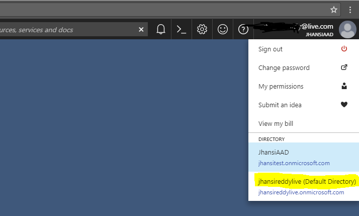

*Figure 3: Locate your Azure Active Directory*

Keep this AAD selection for the remaining steps.

##### 3.1.5. AADTenantId
The AADTenantId is found in the Azure portal and is called the Directory ID.
Here are the steps to locate your AADTenantId.
In the Azure Portal, select “More services” in the blade. Search for the service “Azure Active Directory”.
Select “Azure Active Directory.

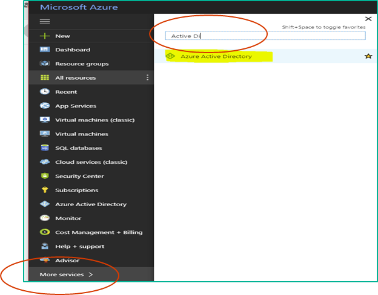

*Figure 4: Locate Azure Active Directory under More Services*

Select “Properties.” 

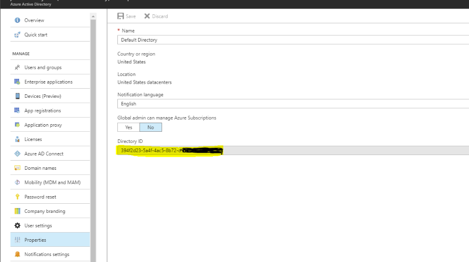

*Figure 5: AADTenantId is the Directory ID*

Locate the Directory ID, and this is your parameter for AADTenantId.

##### 3.1.6. AADWebClientId
The AADWebClientId is found in the Azure portal and is called the Web Client Application ID.
First, you’ll create a new application registration, and then you’ll retrieve the AADWebClientId for the
new application. Here are the steps.
Starting from the Azure Portal, select “Azure Active Directory”. Under Manage, select “App
registrations.”

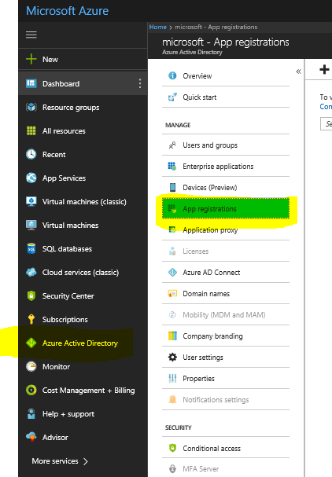

*Figure 6: Azure Active Directory, App registrations*

Select “+ New application registration”. 

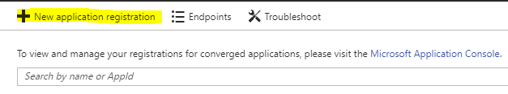

*Figure 7: New application registration*

Enter a Name for your AAD app (This can be any name.). Select the Application type to be “Web app /
API”. Enter a Sign-on URL (e.g. http://www.contoso.com); and this URL is not used and can literally be
the contoso example shown. Select the Create button at the bottom of the page to create an AAD
application.

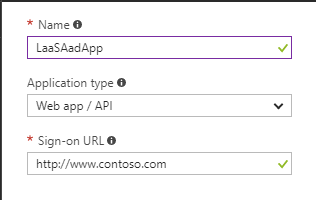

*Figure 8: Create AAD Application*

The AAD application you just created will be in the App Registrations page now. Select the AAD
application you just registered by clicking on the Application name.

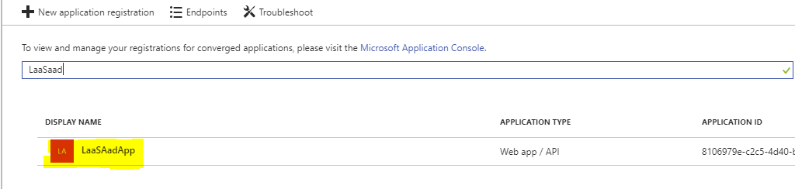

*Figure 9: Locate AAD Application*

Select the AAD application you just registered by clicking on the Application name.

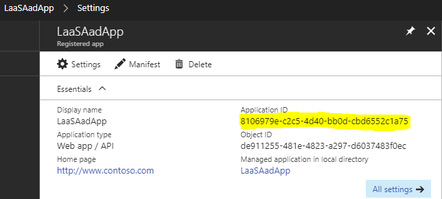

*Figure 10: Application ID is the AADWebClientId parameter*

Locate the Application ID, and this is your parameter for AADWebClientId.

##### 3.1.7. AADWebClientAppKey
The AADWebClientAppKey is found in the Azure portal and is called the AAD WebClient Key.
Start at the same location as where you located the Application ID and select Keys. 

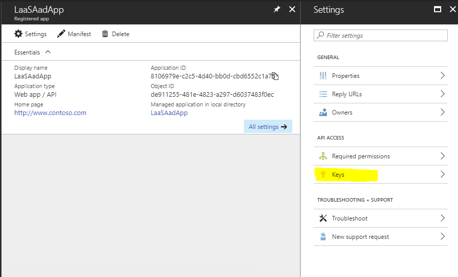

*Figure 11: Keys*

Enter Key description (e.g. aadKey), select Duration, select Save.

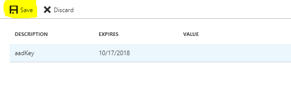

*Figure 12: Key settings*

Copy the key Value. This is the only time you will be able to see the Value, so you must retrieve it now.

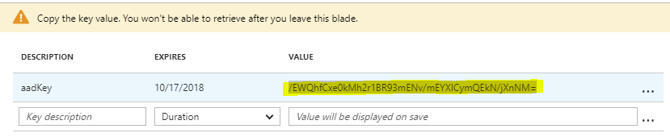

*Figure 13: Key Value*

Locate the parameter, and this is your value for AadWebClientAppKey.

##### 3.1.8. Subscription Name
Go to main azure portal page, https://portal.azure.com. Navigate to your subscription (Hint: Search for
“Subscriptions” in the search bar at the top of the Azure portal. Select Subscriptions.) 


*Figure 14: Search and select Subscriptions*

Select any subscription associated with your default AAD. This will also be the Azure subscription you
will use to deploy your Open edX on Azure.

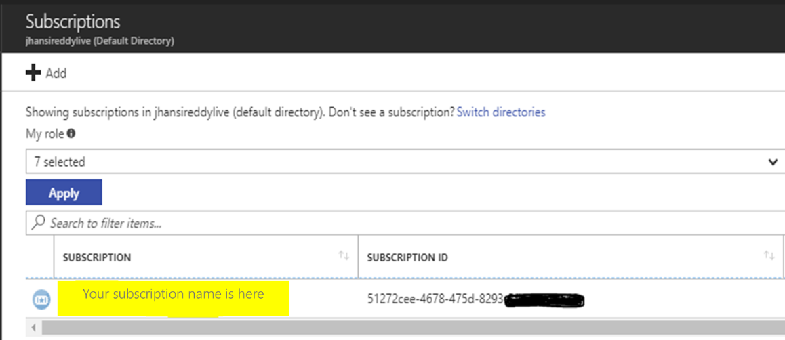

*Figure 15: Locate Subscription Name8

Locate the Subscription name, and this is your parameter for AzureSubscriptionName.
Stay at this location in the Azure Portal for the next step.

##### 3.1.9. Grant access to your AAD Application
In this step, you will use your grant access to the to the AAD Application you created.
Select the subscription. Select Access control (IAM). Select “+ Add” option to add your AAD application
to the subscription.

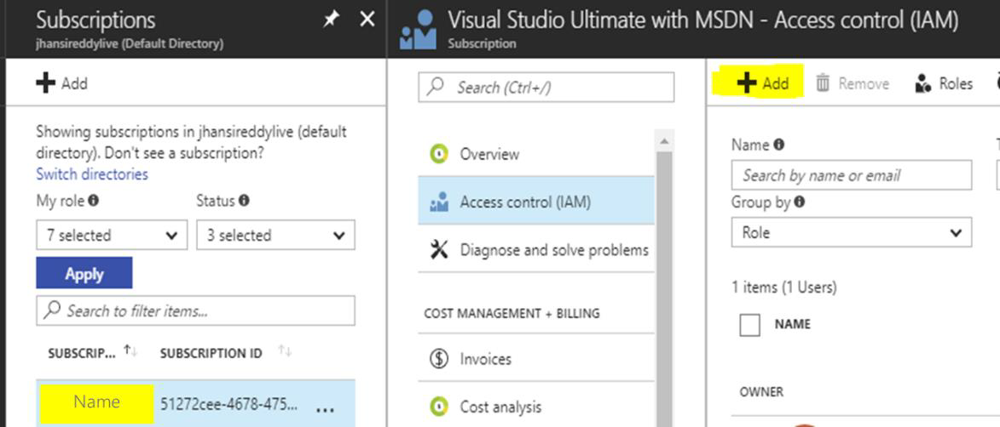

*Figure 16: Add AAD application to Subscription*

In the Role field, select “Owner”. In the Select field, enter the AAD application name you created in a
previous step. Click on the “Save” button to grant “Owner” access to your AAD application.

##### 3.1.10. ClusterAdministratorEmailAddress
Provide an email address for your Open edX on Azure administrator.

##### 3.1.11. Service Account Password
Provide the password that your Open edX on Azure administrator will use to access the LMS, CMS, and Django
Administrator Console. Do not use the ‘@’ symbol in the password. Note for later that the default administrator
name for the Django Administrator Console is edxappadmin.

##### 3.1.12. SMTP Server Name
This is your SMTP Server Name. Refer to Appendix FAQs for guidance on retrieving this value for Office
365 or Gmail.

##### 3.1.13. SMTP Server port
This is your SMTP Server port. Refer to Appendix FAQs for guidance on retrieving this value for Office
365 or Gmail.

##### 3.1.14. SMTP Auth User
This is your SMTP Auth User. Refer to Appendix FAQs for guidance on retrieving this value for Office
365 or Gmail.

##### 3.1.15. SMTP Auth User password
This is your SMTP Auth User password. Refer to Appendix FAQs for guidance on retrieving this value for
Office 365 or Gmail.

##### 3.1.16. AzureCliVersion
The Azure CLI version is 2 if you used the instructions in this guide. If your Azure CLI version is any version, use that
as the parameter. Find the Azure CLI version by running “az --version” in the Windows command prompt.

##### 3.1.17. PlatformName
The platform name will be used in various places in the Open edX application (This can be your company name).
For example: following the naming convention we are using in this document, we can change this to “Contoso
Academy”.

##### 3.1.18. PlatformEmailAddress
Email address used by the platform (application) as default email address for sending email messages.

### 4. Deployment
 You are now ready to deploy the LaaS configuration of Open edX on Azure.

#### 4.1. Run Deployment Script
Open Windows PowerShell as an Administrator and run your deployment script.
Note: You may want to set Execution policy to bypass to run the script.
~~~~
Set-ExecutionPolicy Bypass
~~~~

Note: Disregard the following error message if the rest of the deployment runs without any errors.

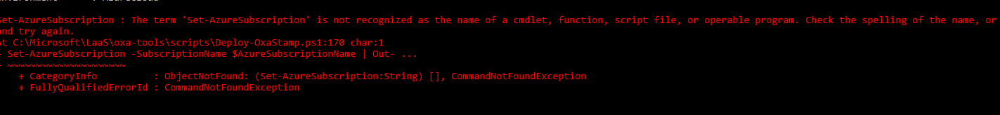

#### 4.2. Two-Step Process
Deployment is a two-step process.
1. Provisioning of the resources (VMs) : Takes ~15 minutes
2. Deploying the bits to VMs: Takes ~2 hours

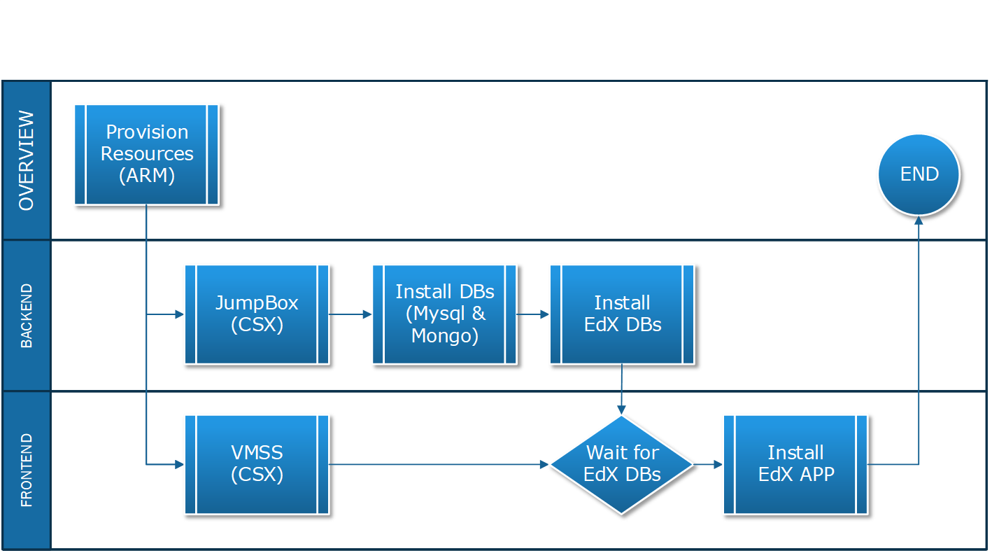

*Figure 17: Deployment Process*

After the initial cluster is set up, you should see the following screen in your PowerShell window. Your
deployment is not complete yet.

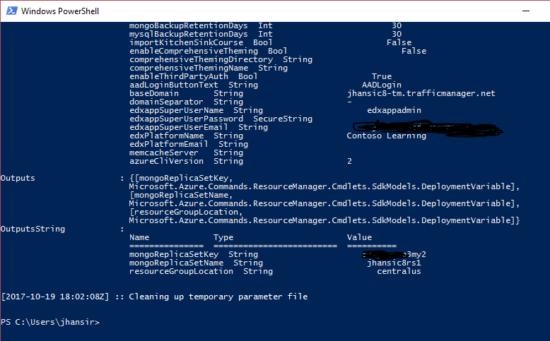

*Figure 18: PowerShell view after running deployment script*

#### 4.3. Email Notifications
If your SMTP settings are setup correctly, within 20-minutes you will receive an email with Subject “OXA
Bootstrap – [Cluster Name] “ and the body of the email states “Installation of EDX Application (VMSS)
has been scheduled.” At this point the system starts to provision and setup necessary VMs and
configurations. You can see the VMs being created in the Azure portal under the resource group under 
the [Cluster Name] you have chosen. In the Azure Portal, under Deployments, you’ll see Succeeded,
although this does not mean the deployment is complete. Wait for all 5 successful email messages.
Deploying the bits to the stamp configuration takes about 1.5 hrs. Email is generated at regular intervals
of the process. The emails with following information.
• Installation of EDX Application (VMSS) has been scheduled
• Installation and configuration of backend database applications (mysql and mongo)
• Installation of EDX database scheduled
• Installation the EDX Database successfully completed
• Completion of installation of edx app (vmss) completed
Important Note: It is very important to have your email settings (SMTP) working. Please do not proceed
with deployment and setup activities until you start receiving notification messages. Email notifications
are integral part of successful Open edX deployment. If you do not receive the initial email within 20-
minutes, there is a problem that needs to be fixed. If email is not set up properly, email cannot be sent
to your learners later.
Your deployment is successful only if you receive all 5 emails messages with successful completion
status.
#### 4.4. Completion and Testing
Once the deployment is complete, you can access the LMS and CMS. The URLs will look similar to this.
• https://lms-[Cluster Name]-tm.trafficmanager.net
https://cms-[Cluster Name]-tm.trafficmanager.net
In the Azure portal, select Resource groups (icon ) to see all the resources associated with your
deployment.

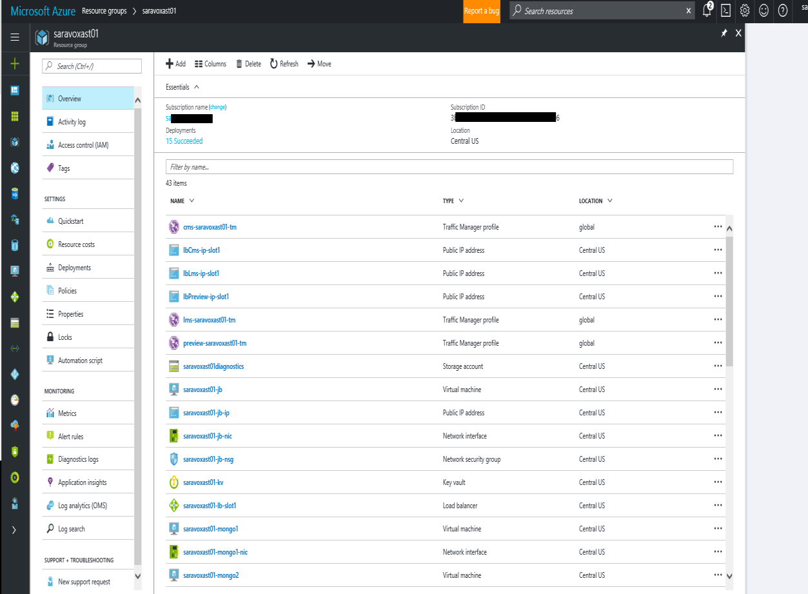

*Figure 19: See all Resources in your deployment*

To access the LMS and CMS, enter ‘Traffic Manager profile’ into the ‘Filter by type’ field. This will filter
the resources so that it’s easier to find the LMS and CMS.
Select the LMS or CMS resources, and the DNS name will be shown.

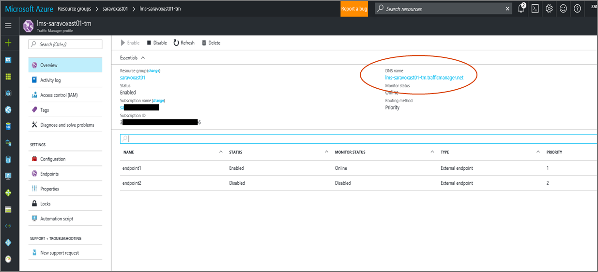

*Figure 20: Find LMS or CMS URL*

If you can access the LMS and CMS, the installation is successful. Congratulations!

 ### 5. Post Deployment
 You now have the LaaS configuration for Open edX on Azure running. There are a few post deployment
steps. After these steps are completed, follow the Microsoft Certificate Onboarding Document to
enable certificate issuance on your Open edX platform.
#### 5.1. Register your domains
* Register dns
* Through admin panel create a cname entry connecting your registered domain to traffic
manager end-point
* For example:
    * If your registered domain for LMS is contosoacademy.com
        * Do cname mapping of contosoacademy.com to name of your traffic manager LMS endpoint. lms-[clustername]-tm.trafficmanager.net
    * If your CMS end point is studio.contosoacademy.com
        * Do cname mapping of studio.contosoacademy.com to name of your traffic manager CMS endpoint. cms-[clustername]-tm.trafficmanager.net
    * If your preview endpoint is preview.contosoacademy.com
        * Do cname mapping of preview.contosoacademy.com to name of your traffic manager preview endpoint. Preview--[clustername]-tm.trafficmanager.net
#### 5.2. Login with Admin credentials
These steps cover login to LMS, CMS, and Django Administrator Console.
##### 5.2.1. LMS and CMS admin credentials
The email address is the cluster email address ClusterAdministratorEmailAddress you specified in
PowerShell deployment script. The password is the Service Account Password you specified in
PowerShell deployment script.
##### 5.2.2. Django admin credentials
The URL for Django admin panel will be your lmsurl/admin. In our example, it would be
www.contosoacacademy.com/admin. The default UserName is edxappadmin. The password is the
Service Account Password you specified in PowerShell deployment script
 ### 6. FAQs
 Here are answers to frequently asked questions.
#### 6.1. Why aren’t the deployment status emails working?
We have worked on this issue and have updated the instructions for Office 365 and Gmail. Please follow
the following guidance to receive deployment notifications and the ability to email users.
This deployment configures an SMTP relay that allows deployment notifications and other system emails
to be sent to the cluster administrator(s). It has come to attention that this wasn’t working well with
third-party email providers like Gmail or Outlook/Office 365. Therefore, we have made additional
updates to support two providers: Gmail & Office 365.

There are five (6) deployment email parameters:
* ClusterAdministratorEmailAddress – This is any address or distribution list where you’d like all
notification emails will be sent.
* SMTPServer – This is the SMTP server fully qualified address.
* SMTPServerPort – This is the communication port on the SMTP server specified above.
* SMTPAuthenticationUser – This is the user name to authenticate with on the SMTP server
specified above.
* SMTPAuthenticationUserPassword – This is the corresponding password for authentication.
* PlatformEmailAddress – Email address used for all platform communications.
##### 6.1.1. Office 365 settings
The SMTPServer & SMTPServerPort details for Office 365 can be found here:
https://support.office.com/en-us/article/POP-and-IMAP-settings-for-Outlook-Office-365-for-business7fc677eb-2491-4cbc-8153-8e7113525f6c
See the “POP and IMAP settings for Office 365 for business email” section.
The SmtpAuthenticationUser is typically the email address of the account with SMTP relay access.
The SmtpAuthenticationUserPassword is the password of the account with SMTP relay access.
Here is an example.
I have an Office 365 account oxa-admin@contoso.com. To login to this account, I use the following
password: 123@contoso_com. I’d like to send all notifications to oxanotifications@contoso.com which
is a distribution list to my engineering team. The email portion of the deployment script would be:
~~~~
-ClusterAdministratorEmailAddress oxanotifications@contoso.com -SmtpServer "smtp.office365.com" -
SmtpServerPort 587 -SmtpAuthenticationUser "oxa-admin@contoso.com" -
SmtpAuthenticationUserPassword "123@contoso_com" -PlatoformEmailAddress "enrollments@contoso.com"
~~~~

##### 6.1.2. Gmail settings
The SMTPServer & SMTPServerPort details for Gmail can be found here:
https://support.google.com/a/answer/176600?hl=en
See the “Use the Gmail SMTP Server” section.
The SmtpAuthenticationUser is typically the email address of the account with SMTP relay access.
The SmtpAuthenticationUserPassword is an application password. The password for the email address
you are using for SmtpAuthenticationUser will not work. You must instead create and use an App
Password that is associated with the email address. Creating this application password has a pre-
requisite: your account must have 2-Step Verification enabled. Here’s how to configure your account for
2-Step Verification: https://support.google.com/accounts/answer/185839?hl=en.
Create an App Password: https://support.google.com/accounts/answer/185833?hl=en See the “How to
generate an App password” section.
Here is an example.
I have a Gmail account oxa-admin-team1@gmail.com. To login to this account, I use the following
password: 123@contoso_com. I want to send all notifications to oxanotifications-team1@gmail.com. I
also need a separate App password which I generated as eekqiutsqrvliube under my “oxa-adminteam1@gmail.com” account. The email portion of the deployment script would be:
~~~~
-ClusterAdministratorEmailAddress oxanotifications-team1@gmail.com -SmtpServer "smtp.gmail.com" -
SmtpServerPort 587 -SmtpAuthenticationUser "oxa-admin-team1@gmail.com" -
SmtpAuthenticationUserPassword "eekqiutsqrvliube" -PlatoformEmailAddress "enrollmentteam1@gmail.com"
~~~~

Hint: You can optionally test SMTP settings in a sample application before using them in the deployment
script.
#### 6.2. Deployment failed due to exceeding quota limits of Core
The error message below typically is shown if your subscription doesn’t have capacity support enough
cores. You should file a ticket with Azure to increase more VM Capacity (cores) to your subscription.
~~~~
Message=Operation results in exceeding quota limits of Core. Maximum allowed: 10, Current in use: 5,
Additional requested: 12.
~~~~

#### 6.3. How do I access the VMs after deployment?
Accessing the VMs is done via SSH. There is only one entry point and that is the JumpBox.
It is assumed you have logged into the azure portal (portal.azure.com) and selected your target azure
subscription.
Here's how to proceed:
1. From the azure portal, click on Resource groups icon and select the resource group you created.
It will be the name of your cluster ([Cluster Name] deployment parameter).
2. From within the list of resources, search for "jb".
3. The search should return a list of resources associated with your JumpBox.
4. Click on the resource named “[Cluster Name]-jb-ip” and copy the value of its DNS Name.
5. From your Bash console type the following:
a. ssh [ the admin user name from your parameters.json file ]@[ domain name of your
JumpBox] -i [ path to your SSH private key]
6. This should log you into the JumpBox
Once you have access to the JumpBox, all other servers will be available via the private network. If you'd
like to access a specific machine, do the following:

* From the azure portal, click on resource groups icon and select the resource group you created
as part of the bootstrap. It will be the name of your cluster ( [Cluster Name] deployment
variable).
* From within the list of resources, search for "vnet".
* The search should return the Virtual Network Resource named “[Cluster Name]-vnet”
* Click on the Virtual Network Resource. It should list all network interfaces (NICs) associated with
all resources connected to your virtual network. These are private ip addresses. For the
LMS/CMS frontend, the resource will be named like “[Cluster Name]-vmss-
[deploymentVersionId from your parameters.json file ]”
* Once you determine which NIC you’d like to connect to, do the following:
    * ssh [IP Address]
    where [IP Address] is the private IP address of the NIC associated with server you’d like to
connect to.
#### 6.4. Why am I seeing degrading status on the VMs in the Azure portal?
This typically means something went wrong with the deployment. The only way to know the details of
error is to have correct email configuration where you will see notifications and details of failed
deployments. Please revisit the instructions on email parameters.
#### 6.5. I’m having trouble with my service account password
There is now a parameter included in the deployment script for the service account password. Please
make sure that this password doesn’t have any non-alpha numeric characters. Mongo DB has some
restrictions.
#### 6.6. What updates effect installations prior to July 2017?
Open edX deployments prior to July 7, 2017 need few configuration updates to have end-to-end LaaS
flow working. The below changes are ONLY to be used if you already have Open edX running with
users taking courses on a paltform that is deployed prior to July 7th .
Sync the configuration files from the repository, https://github.com/Microsoft/oxatools/tree/oxa/master.fic, to new local folder. This path will become your [Enlistment Root].
From your Bash console, run the following command:

~~~~
git clone -b oxa/master.fic https://github.com/Microsoft/oxa-tools.git
~~~~

Run an update script which sets up right configurations.
From a PowerShell session in Administrator mode, execute the following commands:

~~~~
[array]$upgradeParameters = @( @{"name"="target-user"; "value"="[the adminUsername from
your parameters.json file]"}, @{"name"="cluster-admin-email"; "value"="[Your Email Address]"})
[Enlistment Root]\scripts\Deploy-CustomScriptsExtension-v2.ps1 -AzureSubscriptionName
[Subscription Name] -ResourceGroupName [Cluster Name] -AadWebClientId "[AAD web client ID]" -
AadWebClientAppKey "[AAD web client app key]" -AadTenantId "[AAD tenant id]" -TemplateFile
"[Enlistment Root]\templates\stamp\stamp-v2-backend-upgrade.json" -TemplateParameterFile
"[Enlistment Root]\templates\stamp\stamp-v2-backend-upgrade-parameters.json" -
ClusterAdmininistratorEmailAddress [Your Email Address] -InstallerPackageName
"enablemobileapi" -UpgradeParameters $upgradeParameters
~~~~

Note: Replace all the highlighted parameters with your own settings. Then run the following commands.
It will approximately take 2-5 minutes for these commands to run and update the settings.
Settings:
* [Your Email Address] The email address is used to send notifications regarding the update
failures. If deployment succeeds you will not receive any emails
* [OS User Account]: the existing operating system user account whose authorized key you want
to rotate
* [Path to SSH Public Key]: the full path to the replacement public key
* [Enlistment Root]: location where the oxa-tools repository was cloned
* [Subscription Name] = Name of your azure subscription
* [Cluster Name] = name of the existing azure STAMP cluster/ resource group you intend to
update
* [AAD web client ID] - Your AAD Web Client Id
* [AAD web client app key] - Your AAD Web Client Id
* [AAD tenant id] - Tenant Id of the AAD entity in which you have the web client
* [Your Email Address] - Your/Admin email address
Once these commands are executed, the configurations on your VMs will be updated and your end-toend integration with academy.microsoft.com will work.

#### 6.7. My deployment failed, and I am getting several emails with error logs
If your deployment failed and email settings are setup correctly, you will start getting several emails
with log files attached. Log files have important diagnostic information on what went wrong. It is good
to delete the resource group from the Azure portal (portal.azure.com) so that you will not use Azure
resources.

